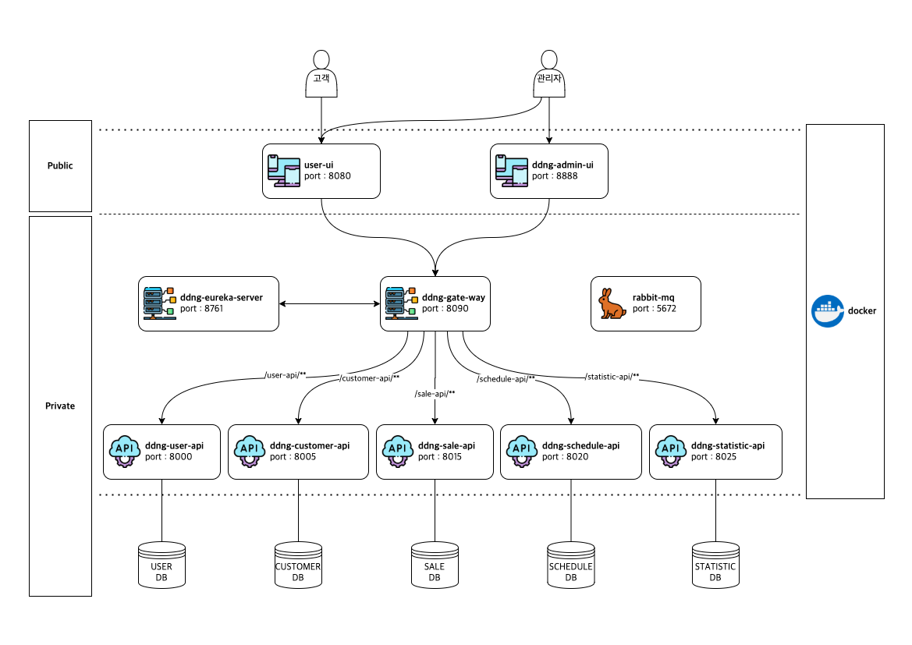

# About
MSA 아키텍쳐 기반 똥강아지 애견샵 관리 RESTful API 프로젝트.

## Technics
1. Spring Boot
2. Spring JPA
3. Spring Cloud Eureka
4. Spring Cloud Zuul
5. RabbitMQ

## Services
### client
* application name : ddng-admin-ui
* port : 8080
### eureka-server
* application name : ddng-eureka-server
* port : 8761
### gate-way
* application name : ddng-gate-way
* port : 8090
* routes
  * /user-api/** : ddng-user-api
  * /customer-api/** : ddng-customer-api
  * /sale-api/** : ddng-sale-api
  * /schedule-api/** : ddng-schedule-api
  * /statistic-api/** : ddng-statistic-api
### user-api
* application name : ddng-user-api
* port : 8000
### customer-api
* application name : ddng-customer-api
* port : 8005
### sale-api
* application name : ddng-sale-api
* port : 8015
### schedule-api
* application name : ddng-schedule-api
* port : 8020
### statistic-api
* application name : ddng-statistic-api
* port : 8025
### Rabbit MQ
* port : 5672
